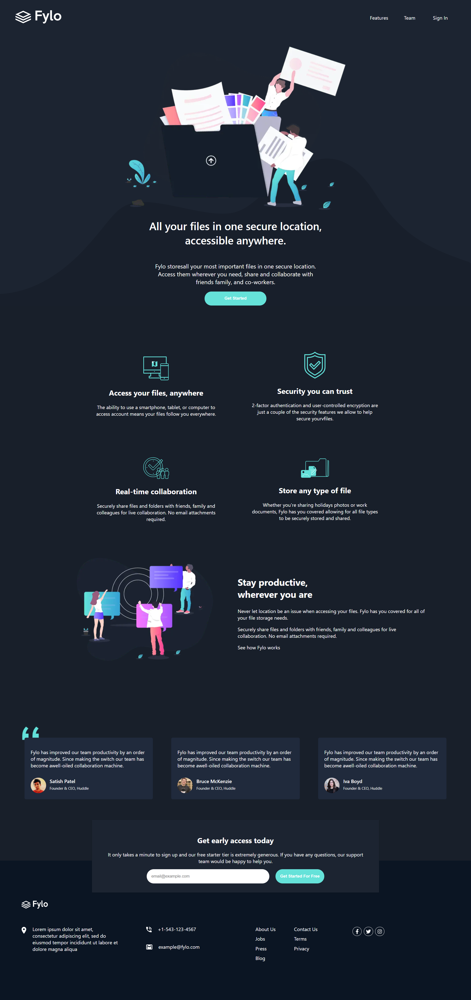

# Frontend Mentor - Fylo dark theme landing page solution

This is a solution to the [Fylo dark theme landing page challenge on Frontend Mentor](https://www.frontendmentor.io/challenges/fylo-dark-theme-landing-page-5ca5f2d21e82137ec91a50fd). Frontend Mentor challenges help you improve your coding skills by building realistic projects.

## Table of contents

- [Overview](#overview)
  - [The challenge](#the-challenge)
  - [Screenshot](#screenshot)
  - [Links](#links)
- [My process](#my-process)
  - [Built with](#built-with)
  - [What I learned](#what-i-learned)
- [Author](#author)

**Note: Delete this note and update the table of contents based on what sections you keep.**

## Overview

### The challenge

Users should be able to:

- View the optimal layout for the site depending on their device's screen size
- See hover states for all interactive elements on the page

### Screenshot

### Links

- Solution URL: [https://fylo-dark-theme-landing-page-master-5jvppzf8m-josephmadras.vercel.app/](https://fylo-dark-theme-landing-page-master-5jvppzf8m-josephmadras.vercel.app/)
- Live Site URL: [https://fylo-dark-theme-landing-page-master-5jvppzf8m-josephmadras.vercel.app/](https://fylo-dark-theme-landing-page-master-5jvppzf8m-josephmadras.vercel.app/)

## My process

### Built with

- [Next.js](https://nextjs.org/) - React framework
- CSS Modules
- Flexbox

### What I learned

I've reviewed the basis of Next JS. But I think using the framework for this design was simply an overkill.
Have I done bare HTML and CSS, I'd finished this challenge in a few hours. I've also learned positions and how to manipulate background-image.

## Author

- Frontend Mentor - [@JosephKabemba](https://www.frontendmentor.io/profile/JosephKabemba)
- Twitter - [@joekabemba8](https://www.twitter.com/joekabemba8)
